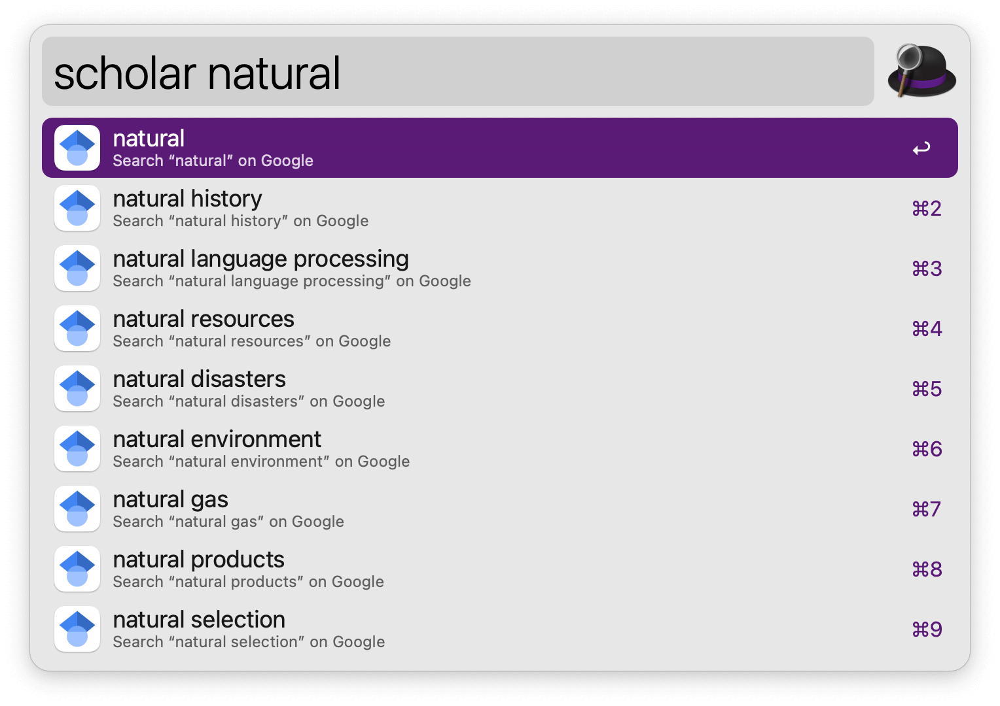

#  Google Scholar Suggest Alfred Workflow

Get in-line Google Scholar search suggestions

[⤓ Install on the Alfred Gallery](https://alfred.app/workflows/alfredapp/google-scholar-suggest)

## Usage

Get in-line suggestions from Google Scholar’s search results via the `scholar` keyword. Press <kbd>↩&#xFE0E;</kbd> to open the search results page in the default web browser.

